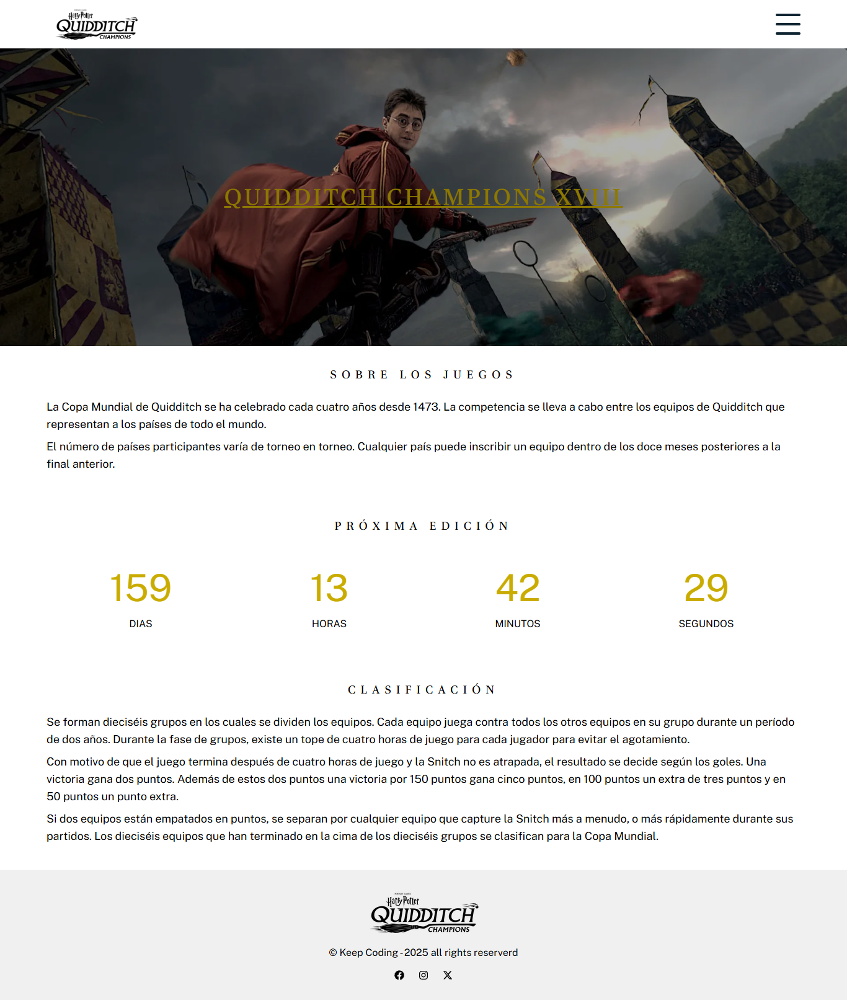

# PRO Frontend-Projekt Abgabe

**KeepCoding Projekte - Web 18**  
Die vollständige Liste der Repositories und Beschreibungen findest du in 📁 [repos-kc-web-18.md](https://github.com/pablo-sch/pablo-sch/blob/main/docs/repos-kc-web-18.md)

## Wähle deine Sprache

- 🇺🇸 [Englisch](README.md)
- 🇪🇸 [Spanisch](README.es.md)

<!-- ------------------------------------------------------------------------------------------- -->

## Projektziel

Das Ziel des Projekts ist es, JavaScript- und CSS-Abhängigkeiten mithilfe moderner Technologien (Tailwind, Parcel und TypeScript) zu integrieren und zu konfigurieren, um die Ästhetik zu verbessern, den Produktionsprozess und die Codequalität zu optimieren und eine vielseitige, professionelle Lösung zu erstellen, die sich an eine reale Entwicklungsumgebung anpasst.

<!-- ------------------------------------------------------------------------------------------- -->

## Erlernte und Bearbeitete Kenntnisse

- Verstehen des Tool-Ökosystems, auf das ich mich im Alltag stützen kann.
- Erlernen einer professionelleren Arbeitsweise im Frontend.
- Verstehen von Frontend-Architekturen.
- Wissen, was ein Bundle, ein Build oder eine gepackte Version ist.
- Arbeiten mit CSS-Präprozessoren (SASS).
- Arbeiten mit TypeScript:
  - Typisierung von Variablen.
  - Typisierung von Funktionen.
  - Typisierung von Objekten.
  - Verwendung von Interfaces.
- Einsatz von Bundlern (Gulp, Webpack, Vite/Parcel) zum Bündeln und Optimieren von Ressourcen.
- Konfiguration und Einsatz von Parcel als „Zero-Config“-Entwicklungstool.
- Verstehen und Anwenden von ESModules (import/export) und NPM-Skripten.

<!-- ------------------------------------------------------------------------------------------- -->

## Projektdetails

### Ausgangszustand

- Ausgehend von einer statischen Landingpage ohne jegliche Funktionalität oder Logik.
- Es ist nur das Logo und der Name im HTML implementiert sowie ein CSS-Stylesheet.

### Funktionale Anforderungen

- Erstellen von drei funktionalen Seiten: **Home**, **Teams** und **Kontakt**.
- Alle Inhalte müssen **responsive** sein und einen **mobile-first**-Ansatz verfolgen.
- **Home**:
  - Anzeige eines **Countdowns** der Tage bis zu den nächsten Spielen.
- **Teams**:
  - Anzeige der Wappen der vier Häuser (Hufflepuff, Gryffindor, Ravenclaw, Slytherin).
  - Über eine **API** die Avatare der Charaktere jedes Hauses abrufen und anzeigen.
- **Kontakt**:
  - Ein Kontaktformular mit Validierung für Pflichtfelder und korrektes E-Mail-Format einfügen.
  - Eine Karte anzeigen, die den Standort der Spiele mit **Leaflet** zeigt.

<!-- ------------------------------------------------------------------------------------------- -->

## Verwendete Technologien

### Sprachen

- **HTML**: Zur Strukturierung der Inhalte und Erstellung des Seitenaufbaus.
- **CSS**: Für das Design und visuelle Styling der Seite, um eine attraktive und konsistente Benutzererfahrung zu gewährleisten.
- **TypeScript:** Programmiersprache mit statischer Typisierung, die zu JavaScript kompiliert und die Codequalität sowie Wartbarkeit verbessert.

### Hauptabhängigkeiten

- **Tailwind CSS / PostCSS:** Utility-first CSS-Framework für schnelles, maßgeschneidertes Design, mit PostCSS zur Verarbeitung des von Tailwind generierten CSS.
- **Prettier:** Automatischer Code-Formatter, der hilft, einen konsistenten Stil im Projekt beizubehalten.
- **rimraf:**

<!-- ------------------------------------------------------------------------------------------- -->

## Installations- und Nutzungshinweise

### Softwareanforderungen

- **[Git](https://git-scm.com/downloads)** (getestet mit Version **2.47.1.windows.1**)
- **[Visual Studio Code](https://code.visualstudio.com/)** (getestet mit Version **1.99.0**)

### Klonen des Repositories

Projekt

```bash
   git clone https://github.com/pablo-sch/keepcoding-07-web-components.git
```

Demo


### Gebrauchsanweisungen

Starte Parcel im Entwicklungsmodus, um einen lokalen Server mit automatischem Reload zu starten.

```sh
npm run start
```

Starte Parcel im Entwicklungsmodus und öffne die Anwendung automatisch im Browser.

```sh
npm run start:open
```

Leere den Ausgabefolder und erstelle eine optimierte Produktionsversion ohne Source Maps.

```sh
npm run build
```

Lösche rekursiv den Ordner `dist`, um Artefakte früherer Builds zu entfernen.

```sh
npm run clear
```

<!-- ------------------------------------------------------------------------------------------- -->

## Projektvorschau

### Home



### Teams


### Kontakt


<!-- ------------------------------------------------------------------------------------------- -->

## Beiträge und Lizenzen

Dieses Projekt hat keine externen Beiträge oder Lizenzen.
