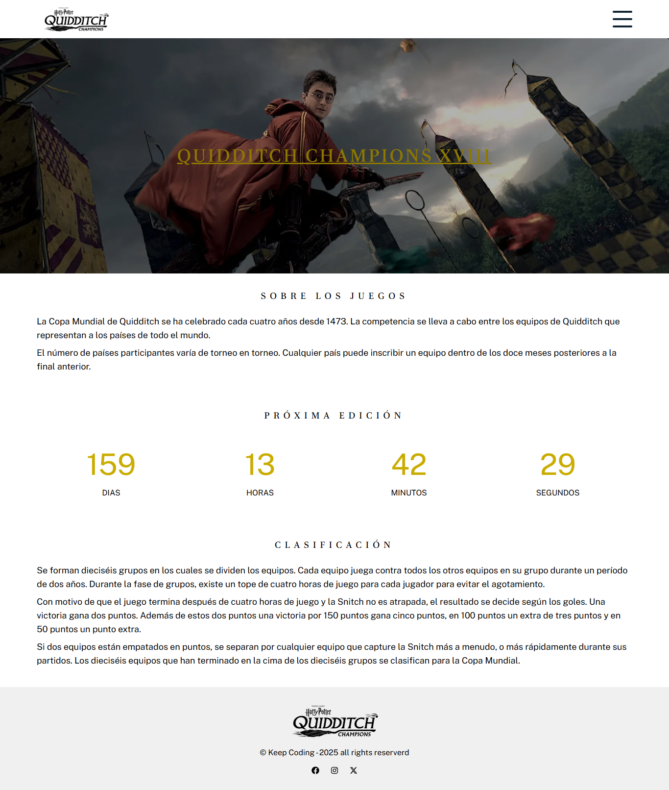
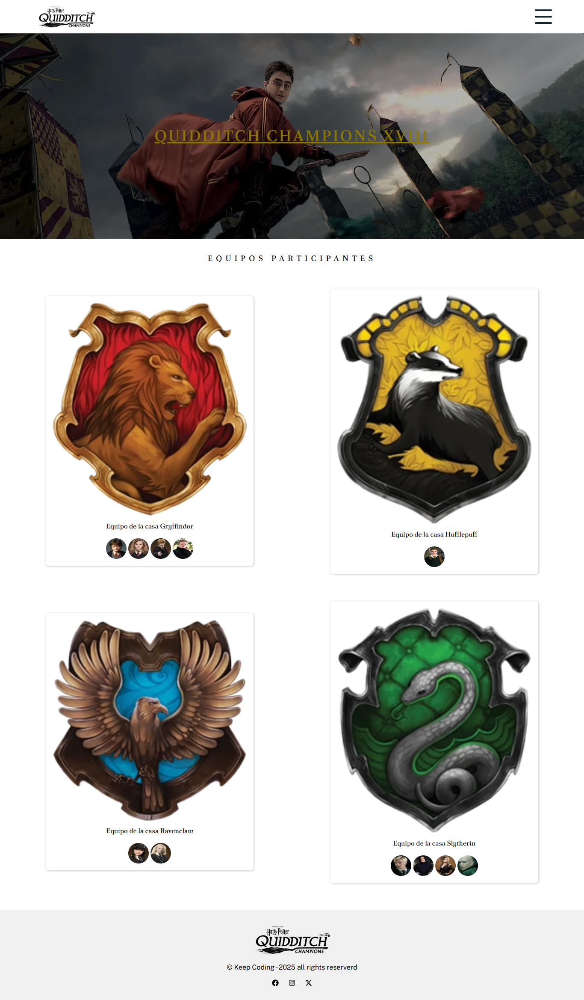
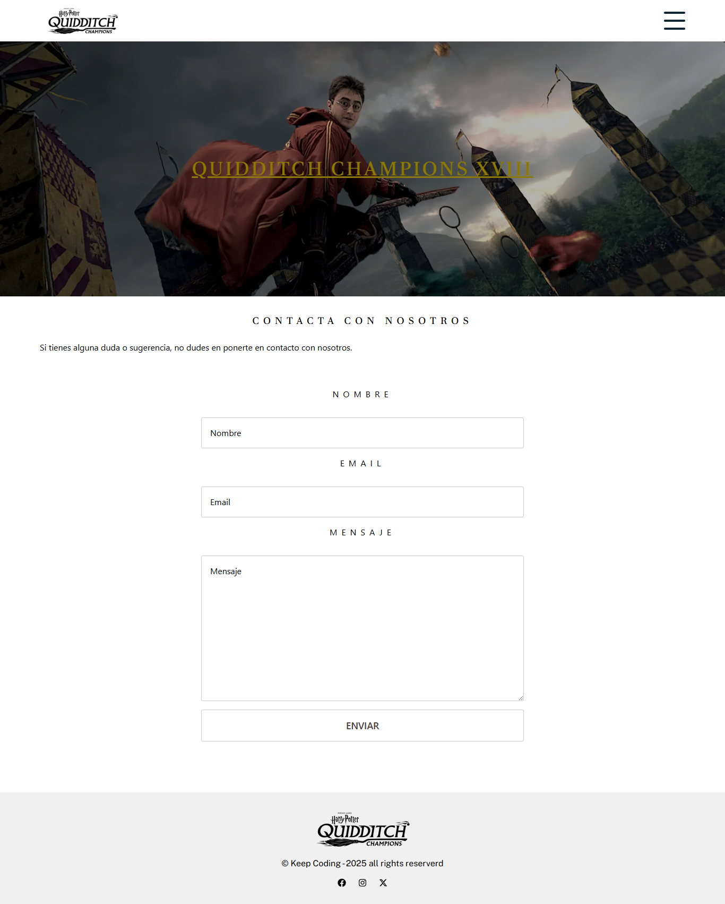

# PRO Frontend Project Submission

**KeepCoding Projects - Web 18**  
Check the full list of repositories and descriptions in 📁 [repos-kc-web-18.md](https://github.com/pablo-sch/pablo-sch/blob/main/docs/repos-kc-web-18.md)

## Select your language

- 🇪🇸 [Spanish](README.es.md)
- 🇩🇪 [German](README.de.md)s

## Project Objective

The goal of this project is to integrate and configure JavaScript and CSS dependencies using modern technologies (Tailwind, Parcel, and TypeScript) to enhance styling, optimize the production workflow, and improve code quality, delivering a versatile and professional solution that fits a real development environment.

## Knowledge Learned and Practiced

- Understand the ecosystem of tools available for everyday frontend work.
- Learn how to work in frontend development in a more professional way.
- Understand frontend architectures.
- Know what a bundle, build, or a packaged version is.
- Work with CSS preprocessors (SASS).
- Work with TypeScript:
  - Typing variables.
  - Typing functions.
  - Typing objects.
  - Using interfaces.
- Use bundlers (Gulp, Webpack, Vite/Parcel) to bundle and optimize assets.
- Configure and use Parcel as a “zero-config” development tool.
- Understand and apply ESModules (import/export) and NPM scripts.

## Project Details

### Initial State

- Start from a static landing page without any functionality or logic.
- It only implements the logo and name in the HTML and a single CSS stylesheet.

### Functional Requirements

- Create three functional pages: **Home**, **Teams**, and **Contact**.
- All content must be **responsive** and follow a **mobile-first** approach.
- **Home**:
  - Display a **countdown** of the days until the next games.
- **Teams**:
  - Display the crests of the four houses (Hufflepuff, Gryffindor, Ravenclaw, Slytherin).
  - Use an **API** to fetch and display the avatars of the characters from each house.
- **Contact**:
  - Include a contact form with validation for required fields and correct email format.
  - Display a map showing the location of the games using **Leaflet**.

## Technologies Used

### Languages

- **HTML**: For structuring content and creating the webpage layout.
- **CSS**: For visual design and styling, ensuring an attractive and consistent user experience.
- **TypeScript**: A statically-typed programming language that compiles to JavaScript, improving code quality and maintainability.

### Main Dependencies

- **Tailwind CSS / PostCSS**: A utility-first CSS framework for rapid, custom design, with PostCSS processing the CSS generated by Tailwind.
- **Prettier**: An automatic code formatter that helps maintain a consistent style throughout the project.
- **rimraf**:

## Installation and Usage Instructions

### Software Requirements

- **[Git](https://git-scm.com/downloads)** (tested on version **2.47.1.windows.1**)
- **[Visual Studio Code](https://code.visualstudio.com/)** (tested on version **1.99.0**)

### Cloning the Repository

Project

```bash
   git clone https://github.com/pablo-sch/keepcoding-07-web-components.git
```

Demo


### Usage Instructions

Start Parcel in development mode, launching a local server with automatic reload.

```sh
npm run start
```

Start Parcel in development mode and automatically open the application in the browser.

```sh
npm run start:open
```

Clean the output folder and generate an optimized production build without source maps.

```sh
npm run build
```

Recursively delete the `dist` folder to remove artifacts from previous builds.

```sh
npm run clear
```

## Project Preview

### Home



### Teams



### Contact



## Contributions and Licenses

This project has no external contributions or licenses.
